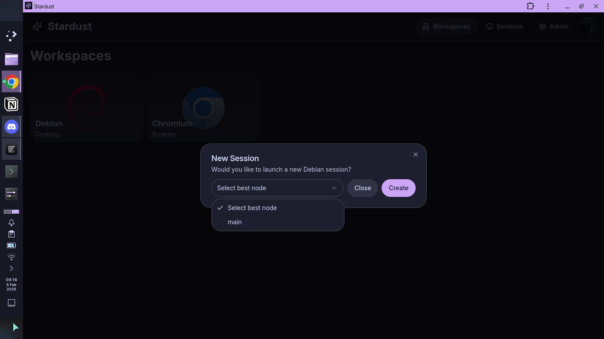

When you click on a workspace in Stardust, you will see a popup asking for session creation settings and to confirm you want to create one.

A Stardust node runs the actual Docker container. Stardust automatically selects the best available node based on CPU usage, but that can be overriden by selecting a different node in the dropdown.
