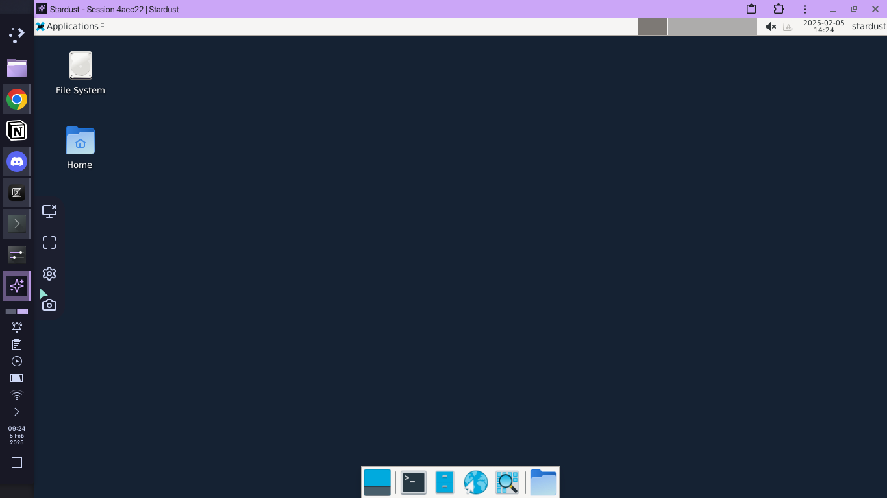
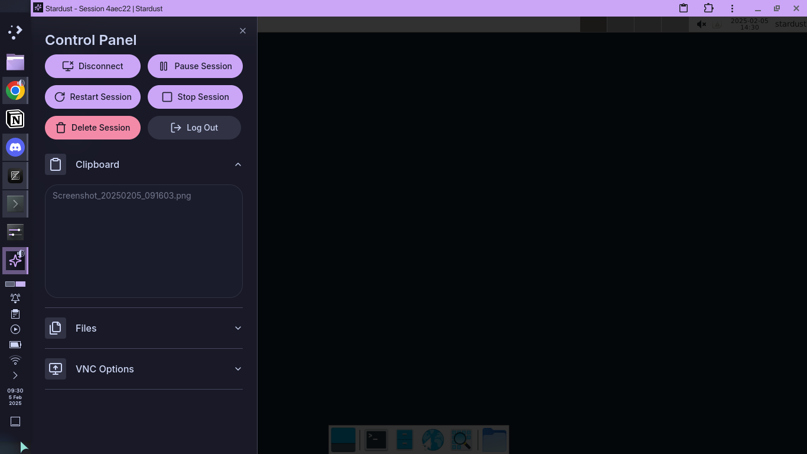
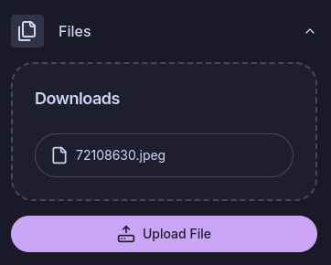
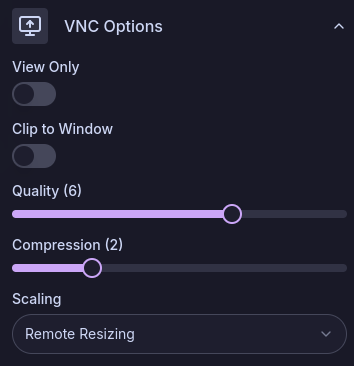

The Stardust VNC UI is a custom implemention of noVNC. On the left hand sidebar, there is a menu with these buttons, ordered top-bottom:

- **Disconnect**: Disconnects the VNC session and takes you to the workspaces page.
- **Fullscreen**: Toggles fullscreen mode.
- **Settings**: Opens the settings panel.
- **Screenshot**: Takes a screenshot of the VNC session and downloads it to your machine.

## Settings Menu

The Settings Menu allows you to manage session settings and send/receive clipboard and files.

### Clipboard

This textbox is updated with the contents of the session's clipboard. You can put text in the box and it will be available in the session's clipboard.

If you have clipboard access enabled, the clipboards of the session and your device will already automatically sync.

### Files

The files section shows a list of all the files in the session's Downloads folder. Click the filename to download the file to your device.

The upload file button uploads a file from your device to the session's Uploads folder (normally `~/Uploads`).

### VNC Options

_paraphrased from [noVNC documentation](https://github.com/novnc/noVNC/blob/master/docs/API.md)_

VNC Options are automatically saved on change on your local device.

#### View Only

If on, events (e.g. key presses or mouse movement) are prevented from being sent to the session. Disabled by default.

#### Clip To Window

This only applies if you have no [scaling](#scaling) applied.

Indicates if the session should be clipped to its container if the container's resolution is more than the view page. When disabled scrollbars will be shown to handle the resulting overflow. Disabled by default.

#### Quality

The quality of the VNC stream. The higher the quality, the more bandwidth is used. Value 0 implies low quality and 9 implies high quality. Default value is 6.

#### Compression

Controls the compression level of the VNC stream. Value 0 means no compression. Level 1 uses a minimum of CPU resources and achieves weak compression ratios, while level 9 offers best compression but is slow in terms of CPU consumption on the server side. Use high levels with very slow network connections. Default value is 2.

#### Scaling

Controls the scaling of the VNC session.

- Remote Resizing - Changes the session's resolution to fit the window all the time.
- Local Scaling - Locally scales the session page to fit the window.
- None - No scaling is applied anywhere.
